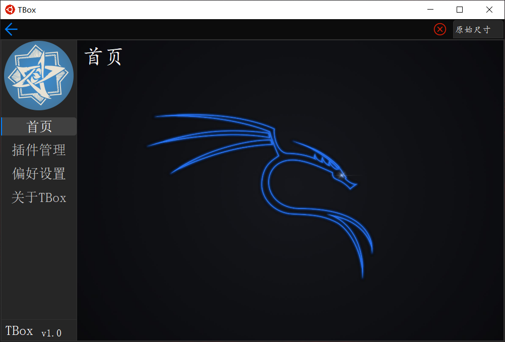
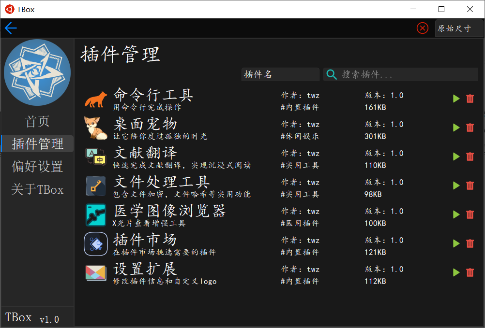
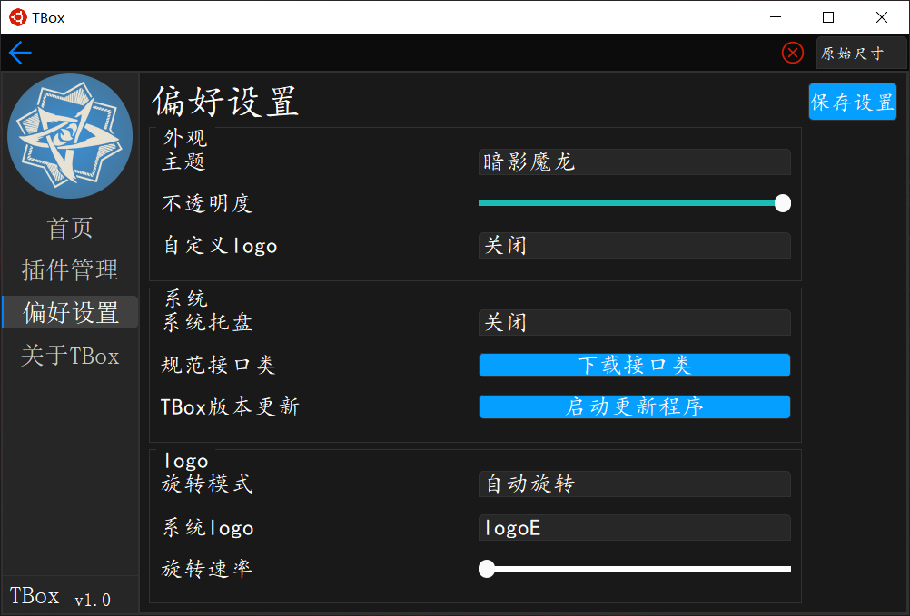
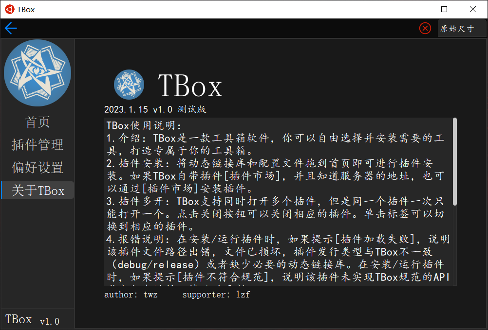
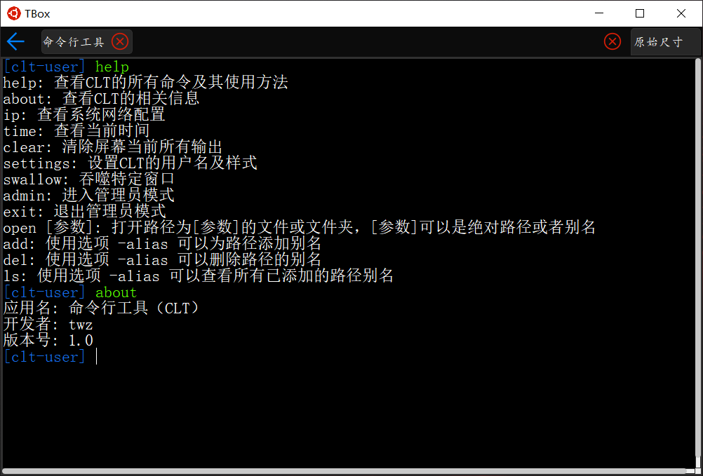
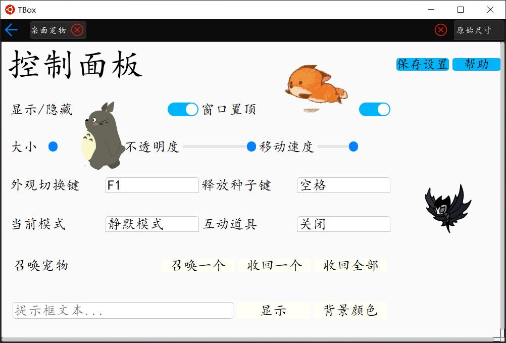
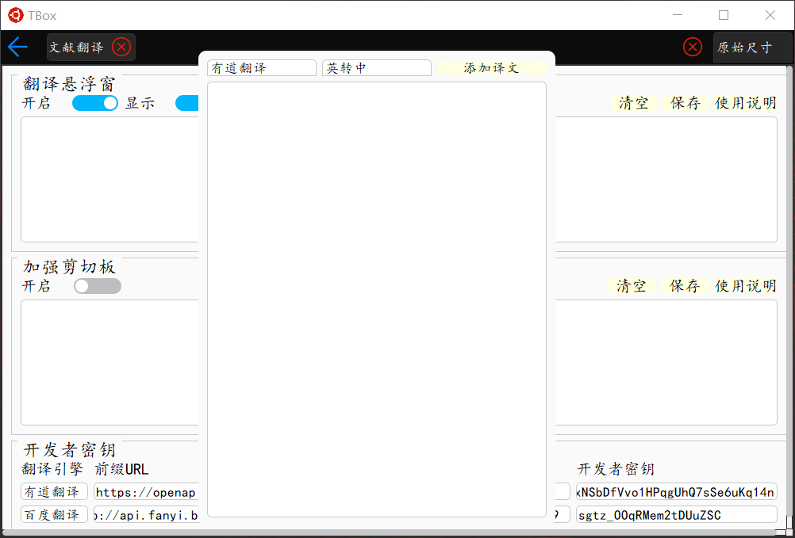
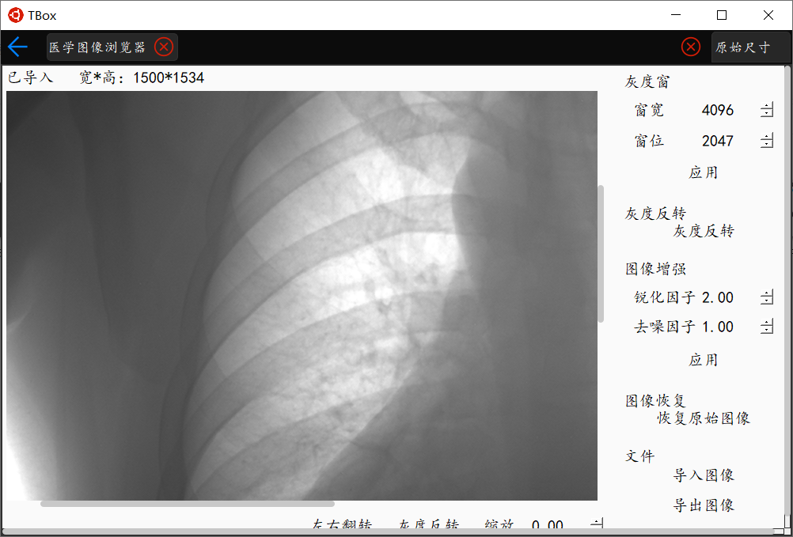
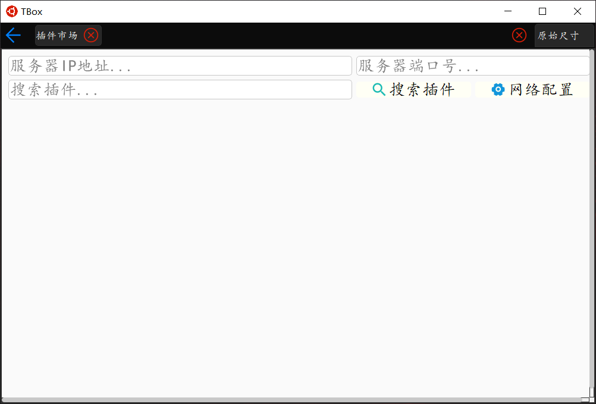
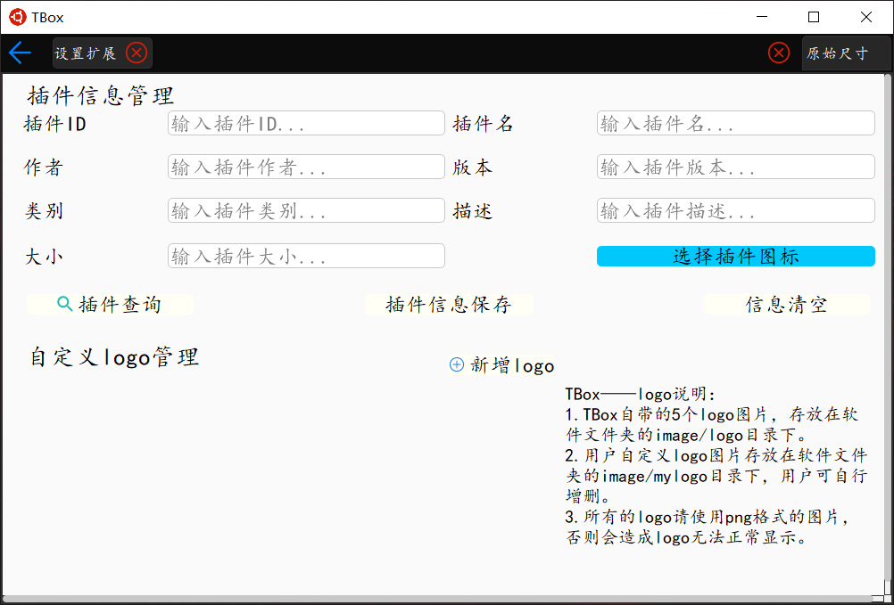

# TBox
## 一、介绍
### 1. 基本信息

TBox是一款基于Qt C++的工具箱。用户可以自行选择安装所需的工具（以插件的形式），将TBox打造成专属于自己的效率软件。TBox基本界面展示如下：

### 2. 使用说明

（1）安装插件：用户有两种安装方式可选，一种是将插件安装包拖入到TBox首页，TBox将会自行识别插件包信息，并引导用户安装；另一种是通过[插件市场]插件搜索可安装的插件，向远程服务器发起插件下载请求。

（2）TBox更新：在偏好设置页启动[TBox更新程序]，即可检查更新并进行版本更新。

### 3.项目结构

（1）TBox：TBox整体上主要由四个大的模块构成，分别是组件、插件、主窗口、插件管理器。组件就是一些自己封装的控件，比如消息框，标签，单个组件的功能也都是比较简单的。至于插件，自行设计了一个抽象基类，所有的插件都继承自这个基类，并实现这个基类的纯虚函数，如果插件是窗口插件的话，还需要同时继承窗口类，然后利用C++的多态特性，实现不同插件在运行时的不同行为。最后就是主窗口或者说主程序，它负责的任务比较多，最基本的就是对插件进行增删改查，还支持用户根据自己的偏好进行一些设置，比如切换外观，还有一个重要的功能是实现插件之间的通信，插件之间是用JSON格式的数据进行通信的。每个插件由：一个动态库、若干配置文件构成。

（2）TBox更新器：向TBox服务器发起更新查询，获取TBox更新包并进行版本的更新。

（3）TBox服务器：一个非常简单的多线程服务器，主要用于下发TBox插件和TBox更新包。服务器采用自行设计的极简的FTP协议（报文只由一个报文头和报文体构成，报文头指明了报文体的大小）。

## 二、插件列表
目前已经开发完成的插件如下（之后会陆续开发一些新的插件）：

### 1. 命令行工具

### 2. 桌面宠物

### 3. 文献翻译

### 4. 文件处理工具

### 5.医学图像浏览器

### 6. 插件市场

### 7. 设置扩展

